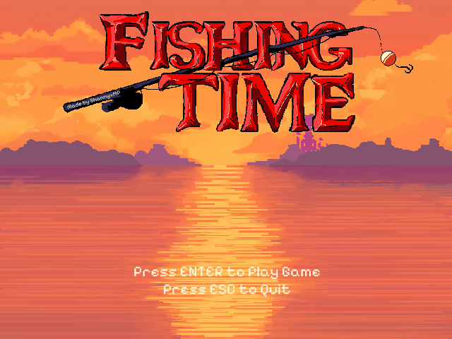

# BEASTFISHING - A GAME USING LUA WITH LÖVE

## Table of contents

- [Overview](#overview)
    - [Screenshot](#screenshot) 
    - [Link](#link)
- [My process](#my-process)
    - [Description](#description)
- [Getting started](#getting-started)
- [Author](#author)
- [Acknowledgements](#acknowledgements)

## Overview

### Screenshot



### Link

Video demo: https://youtu.be/kZOgTTxo4RI

## My process

### Description:

Welcome to my first mini-game (first ever game, for that matter) that I have created using Lua with LÖVE 2D. It is a game where the player aims to collect as many different fish in the time limit provided. Initially produced in Scratch for CS50x's first assessment, I wanted to challenge myself by making that same game under a different framework. It was a big learning curve for me, but I enjoyed many aspects while developing this game myself, such as the visuals. Inspired by a lot of pixel art I had found online, I have hand-drawn almost all of the images in the game. Being a gamer in my earlier years, the music and sound effects I have used within my game may be recognisable to many people - they are soundtracks from Resident Evil, Rhythm Heaven, and Yoshi's Island. Hopefully, it brings a lot of nostalgia to some. Despite a conceptually simple idea, I underestimated how much code was needed to develop this game. The various files within my project represent different game states, and I will explain what each file contains and its role. I will also address my design choices - heavily influenced by complications and time constraints. 

The game consists of six files, most of which are a different game state. The exception is the `main.lua` file that bridges the game's menu and the gameplay itself. The code within `main.lua` is preset to open the `menu.lua` file. 

As the file name suggests, `menu.lua` is a simple menu that prompts the user to play the game or quit using key presses. Initially, I attempted to make buttons that the player can hover over and then select, but it came with an issue that persists in my code. Anytime the player presses the spacebar outside the gameplay, it results in an error. Despite successfully ignoring other keypresses, trying to control the use of the spacebar came at the cost of a cascade of errors. Eventually, time constraints led me to simplify the menu to what it is now, and using the spacebar still results in errors. Any advice on this would be appreciated. The `running.lua` file contains the player interactions - the bulk of the code.

Within the `running.lua` contains many variables and tables involved in scaling, conditionals, and time. Two main functions: 
```lua
function love.keyreleased(key)
    if key == "space" then
        -- Will update key_released table for key pressed
        love.keyboard.key_released[key] = true
        -- Play sound
        sounds.mlem:play()
    --[[ TESTING PURPOSES -> Player is taken back to fishing mode
    elseif key == "b" then 
        backToFishing = true
        lure.x = WINDOW_WIDTH / 2
        lure.y = lure.originalLurePosition
        ]]
    else
        print("Ignoring key press: ", key)
    end
end
```  
```lua
-- Checks whether a specific key was released by querying the love.keyboard.key_released table
function love.keyboard.wasReleased(key)
    -- Will update key_released table for key pressed
    return love.keyboard.key_released[key] or false
end
```
These functions allow the lure to move back and forth along the x-axis when keypress sustained and move the sprite along the y-axis when the keypress is released. A unique sea creature can be caught depending on where along the x-axis the lure is pulled. The game will not accept duplicates - the aim is to seize as many different creatures as possible, and those caught creatures will display on the right side. The game does have a timer (also visually represented by the sun setting) that will eventually reach zero and trigger one of the associated files: `ending1.lua`, `ending2.lua` and `ending3.lua`, depending on whether the player caught no, some or all fish, respectively. Before diving into these three files, I would like to address that the intricacies of the ```running.draw()``` were carefully layered to look more realistic in the surrounding scenery of the 2D game. Separating sprites and objects from each other made proportioning easier.

Once the timer is up, the `running.lua` file changes the game state to one of three ending files depending on the player's collection of creatures. `ending1.lua` and `ending2.lua` are much the same in terms of code: they have the ending image, music, and a timer that, once elapsed, will allow the player to quit the game. This feature prevents unintended keypresses that may result in errors and prematurely terminate the ending scene. `ending3.lua` has additional code. I required the `anim8` library 
```lua
local anim8 = require 'libraries/anim8'
``` 
to animate not only the sprites within the `running.lua`, but the ending where the player has caught all creatures. Each scene is triggered once a certain amount of time has elapsed.

I hope you enjoy this mini-game. It was quite a learning curve for me. Any tips and advice is welcome. 

## Getting started

1. Clone the repository to your local operating machine by entering the following in your terminal (command-line): `https://github.com/ShannyxMP/Beast-Fishing.git`
2. Rename the extension of the compressed folder to `.love`. For example: **Beast-Fishing.zip** => **Beast-Fishing.love**.  
3. From here, you can play the game as a .love file. However, you will need to have installed LÖVE 2D on your operating system which you can get [here](https://love2d.org/).

## Author

*This was a final project for CS50x's Introduction to Computer Science.*

COPYRIGHT 2023-2024 ShannyxMP (formerly ShannyMP)

## Acknowledgements

Character design was heavily inspired by the **great** [Todo Asano](https://dribbble.com/Todo_Asano).

